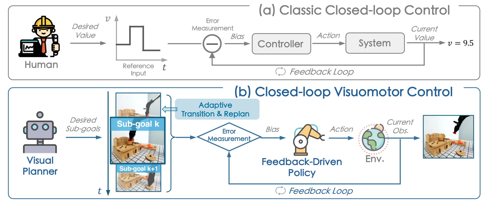
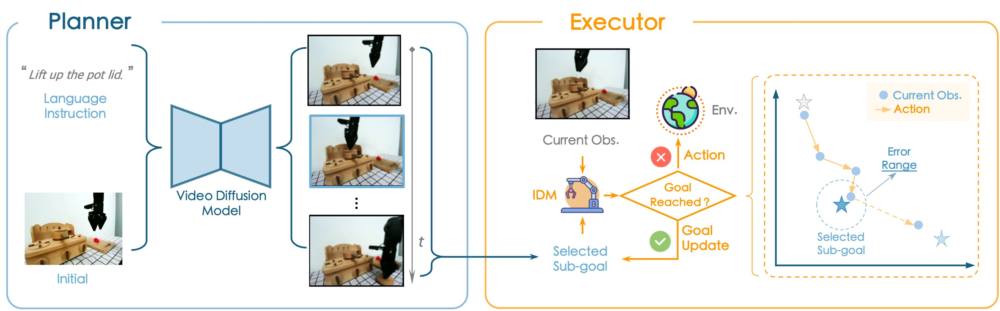
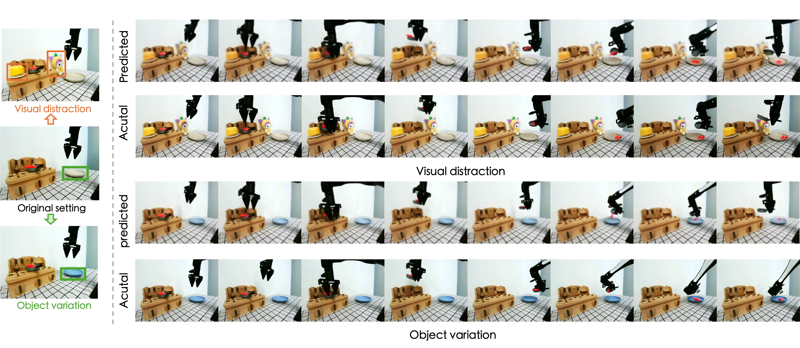
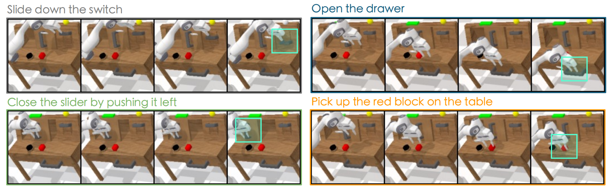

<h1 align="center"> :four_leaf_clover: CLOVER: Closed-Loop Visuomotor Control with Generative Expectation for Robotic Manipulation </h1> 

<div id="top" align="center">
<p align="center">

</p>
</div>

> [Qingwen Bu](https://scholar.google.com/citations?user=-JCRysgAAAAJ&hl=zh-CN&oi=ao), [Jia Zeng](https://scholar.google.com/citations?hl=zh-CN&user=kYrUfMoAAAAJ), [Li Chen](https://scholar.google.com/citations?user=ulZxvY0AAAAJ&hl=zh-CN), Yanchao Yang, Guyue Zhou, Junchi Yan, Ping Luo, Heming Cui, Yi Ma and Hongyang Li
>
:mailbox_with_mail: If you have any questions, please feel free to contact: *Qingwen Bu* ( qwbu01@sjtu.edu.cn )

Full code and checkpoints release is coming soon. Please stay tuned.🦾

## :fire: Highlight

* :four_leaf_clover: ​**CLOVER**  employs a text-conditioned video diffusion model for generating visual plans as reference inputs, then these sub-goals guide the feedback-driven policy to generate actions with an error measurement strategy.

<div id="top" align="center">
<p align="center">

</p>
</div>

* Owing to the closed-loop attribute, ​**CLOVER** is robust to visual distraction and object variation:
<div id="top" align="center">
<p align="center">

</p>
</div>

* This closed-loop mechanism enables achieving the desired states accurately and reliably, thereby facilitating the execution of long-term tasks:
<div id="top" align="center">
<p align="center">

</p>
</div>

<!-- ## :loudspeaker: News

- **[2024/09/xx]** We released our paper on arXiv. -->

## :pushpin: TODO list

- [x] Training script for visual planner
- [ ] Checkpoints release (*Scheduled Release Date*: **Mid-October, 2024**)
- [ ] Evaluation codes on CALVIN (*Scheduled Release Date*: **Mid-October, 2024**)
- [ ] Policy training codes on CALVIN (*Estimated Release Period*: **November, 2024**)


## Getting started <a name="installation"></a>

Our training are conducted with **PyTorch 1.13.1**, **CUDA 11.7**, **Ubuntu 22.04**, and **NVIDIA Tesla A100 (80 GB)**. The closed-loop evaluation on CALVIN is run on a system with **NVIDIA RTX 3090**.

We also did further testing with **PyTorch 2.2.0 + CUDA 11.8**, and the training also goes fine.

1. (Optional) We use conda to manage the environment.

```bash
conda create -n clover python=3.8
conda activate clover
```

2. Install dependencies.

```bash
pip install torch==1.13.1+cu117 torchvision==0.14.1+cu117 --extra-index-url https://download.pytorch.org/whl/cu117
pip install -r requirements.txt
```

3. Installation of CALVIN simulator.

```bash
git clone --recurse-submodules https://github.com/mees/calvin.git
export CALVIN_ROOT=$(pwd)/calvin
cd $CALVIN_ROOT
sh install.sh
```

## Training <a name="Training"></a>

- ### Requirement

  The visual planner requires **24 GB** GPU VRAM with a batch size of 4 (per GPU), video length of 8 and image size of 128.

- ### Preparation

  * We use [OpenAI-CLIP](https://huggingface.co/openai/clip-vit-large-patch14) to encode task instructions for conditioning.

- ### Initiate training of the visual planner (video diffusion model) on CALVIN

  > Please modify **accelerate_cfg.yaml** first according to your setup.

```bash
accelerate launch --config_file accelerate_cfg.yaml train.py \
    --learning_rate 1e-4 \
    --train_num_steps 300000 \
    --save_and_sample_every 10000 \
    --train_batch_size 32 \
    --sample_per_seq 8 \
    --sampling_step 5 \
    --with_text_conditioning \
    --diffusion_steps 100 \
    --sample_steps 10 \
    --with_depth \
    --flow_reg \
    --results_folder *path_to_save_your_ckpts*
```


## Evaluation <a name="Evaluation"></a>

  TODO
<!-- ## :video_game: Getting Started

Generated videos conditioned on the same initial frame and differenct language instruction:
<div id="top" align="center">
<p align="center">

</p>
</div> -->

