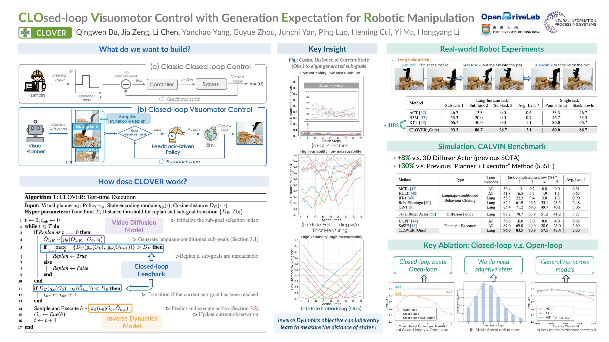

<h1 align="left"> :four_leaf_clover: CLOVER </h1> 

The official implementation of our **NeurIPS 2024** paper: \
**Closed-Loop Visuomotor Control with Generative Expectation for Robotic Manipulation**
<div id="top" align="center">
<p align="center">

</p>
</div>

> [Qingwen Bu](https://scholar.google.com/citations?user=-JCRysgAAAAJ&hl=zh-CN&oi=ao), [Jia Zeng](https://scholar.google.com/citations?hl=zh-CN&user=kYrUfMoAAAAJ), [Li Chen](https://scholar.google.com/citations?user=ulZxvY0AAAAJ&hl=zh-CN), Yanchao Yang, Guyue Zhou, Junchi Yan, Ping Luo, Heming Cui, Yi Ma and Hongyang Li

> 📜 Preprint: <a href="https://arxiv.org/abs/2409.09016">"></a>

> :mailbox_with_mail: If you have any questions, please feel free to contact: *Qingwen Bu* ( qwbu01@sjtu.edu.cn )

Full code and checkpoints release is coming soon. Please stay tuned.🦾

## :fire: Highlight

* :four_leaf_clover: ​**CLOVER**  employs a text-conditioned video diffusion model for generating visual plans as reference inputs, then these sub-goals guide the feedback-driven policy to generate actions with an error measurement strategy.

<div id="top" align="center">
<p align="center">

</p>
</div>

* Owing to the closed-loop attribute, ​**CLOVER** is robust to visual distraction and object variation:
<div id="top" align="center">
<p align="center">

</p>
</div>

* This closed-loop mechanism enables achieving the desired states accurately and reliably, thereby facilitating the execution of long-term tasks:
<div id="top" align="center">
<p align="center">
<td><video src="https://github.com/user-attachments/assets/af8af7fa-98e4-48bc-a9e3-eb8af9cd7348" autoplay></td>
</p>
</div>


## :loudspeaker: News

- **[2024/09/16]** We released our paper on [arXiv](https://arxiv.org/abs/2409.09016).

## :pushpin: TODO list

- [x] Training script for visual planner
- [x] Checkpoints release (*Scheduled Release Date*: **Mid-October, 2024**)
- [x] Evaluation codes on CALVIN (*Scheduled Release Date*: **Mid-October, 2024**)
- [ ] Policy training codes on CALVIN (*Estimated Release Period*: **November, 2024**)


## :video_game: Getting started <a name="installation"></a>

Our training are conducted with **PyTorch 1.13.1**, **CUDA 11.7**, **Ubuntu 22.04**, and **NVIDIA Tesla A100 (80 GB)**. The closed-loop evaluation on CALVIN is run on a system with **NVIDIA RTX 3090**.

We did further testing with **PyTorch 2.2.0 + CUDA 11.8**, and the training also goes fine.

1. (Optional) We use conda to manage the environment.

```bash
conda create -n clover python=3.8
conda activate clover
```

2. Install dependencies.

```bash
cd visual_planner
pip install torch==1.13.1+cu117 torchvision==0.14.1+cu117 --extra-index-url https://download.pytorch.org/whl/cu117
pip install git+https://github.com/hassony2/torch_videovision
pip install -e .
```

3. Installation of CALVIN simulator.

```bash
git clone --recurse-submodules https://github.com/mees/calvin.git
export CALVIN_ROOT=$(pwd)/calvin
cd $CALVIN_ROOT
sh install.sh
```

## :cd: Checkpoints

We release model weights of our **Visual Planner** and **Feedback-driven Policy** at [HuggingFace](https://huggingface.co/qwbu/CLOVER).

## Training: Visual Planner <a name="Training"></a>

- ### Requirement

  The visual planner requires **24 GB** GPU VRAM with a batch size of 4 (per GPU), video length of 8 and image size of 128.

- ### Preparation

  * We use [OpenAI-CLIP](https://huggingface.co/openai/clip-vit-large-patch14) to encode task instructions for conditioning.

- ### Initiate training of the visual planner (video diffusion model) on CALVIN

  > Please modify **accelerate_cfg.yaml** first according to your setup.

```bash
accelerate launch --config_file accelerate_cfg.yaml train.py \
    --learning_rate 1e-4 \
    --train_num_steps 300000 \
    --save_and_sample_every 10000 \
    --train_batch_size 32 \
    --sample_per_seq 8 \
    --sampling_step 5 \
    --with_text_conditioning \
    --diffusion_steps 100 \
    --sample_steps 10 \
    --with_depth \
    --flow_reg \
    --results_folder *path_to_save_your_ckpts*
```


## Evaluation <a name="Evaluation"></a>

- ### Preparation

    1. Set your CALVIN and checkpoint path at *FeedbackPolicy/eval_calvin.sh*
    2. We train our policy with input size of 192*192, please modify the config file correspondingly in [VC-1 Config](https://github.com/facebookresearch/eai-vc/blob/76fe35e87b1937168f1ec4b236e863451883eaf3/vc_models/src/vc_models/conf/model/vc1_vitb.yaml#L7) with `img_size: 192` and `use_cls: False`.

- ### Initiate evaluation on CALVIN simply with

```bash
cd ./FeedbackPolicy
bash eval_calvin.sh
```
    


## :pencil: Citation

If you find the project helpful for your research, please consider citing our paper:

```bibtex
@article{bu2024clover,
  title={Closed-Loop Visuomotor Control with Generative Expectation for Robotic Manipulation},
  author={Bu, Qingwen and Zeng, Jia and Chen, Li and Yang, Yanchao and Zhou, Guyue and Yan, Junchi and Luo, Ping and Cui, Heming and Ma, Yi and Li, Hongyang},
  journal={arXiv preprint arXiv:2409.09016},
  year={2024}
}
```

## Acknowledgements

We thank [AVDC](https://github.com/flow-diffusion/AVDC) and [RoboFlamingo](https://github.com/RoboFlamingo/RoboFlamingo) for their open-sourced work!

